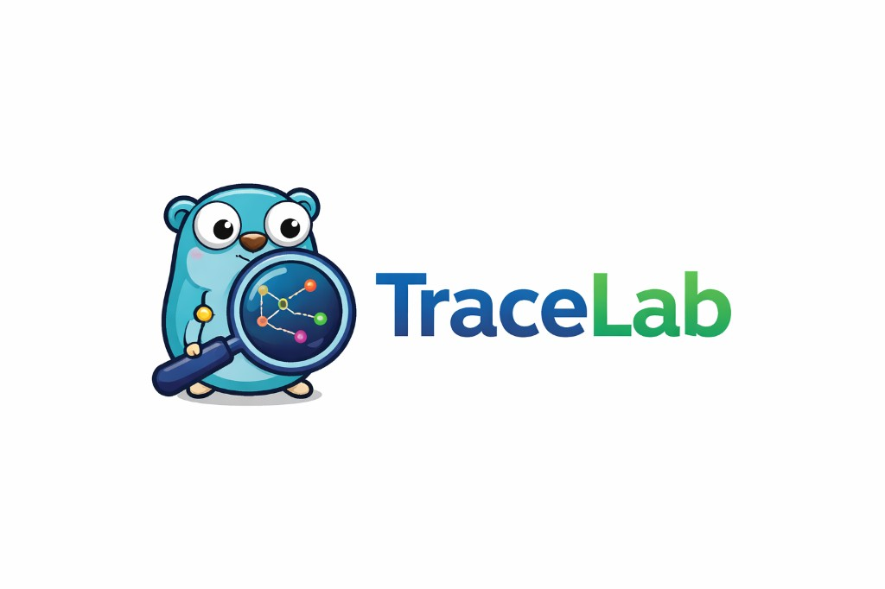

<p align="center">
  
</p>

# TraceLab

> **Live:** [tracelab-web-1033528334340.us-east1.run.app](https://tracelab-web-1033528334340.us-east1.run.app/concept/caching)

A lightweight interactive learning tool for system design concepts.

## Stack

| Layer    | Tech                    |
|----------|-------------------------|
| Frontend | React + TypeScript + Vite |
| Backend  | Go (net/http)           |
| Database | MongoDB (users + future progress; see `.env.example`) |

## Running Locally

### Prerequisites
- Go 1.25+ (matches `services/api/go.mod` and the API Dockerfile)
- Node.js 18+

### Quick Start

```bash
# Install frontend dependencies
make install

# Optional: copy .env.example → .env and fill in secrets (Mongo, GitHub OAuth, JWT)
# Start both API and web in parallel
make dev
```

Or run individually:

```bash
make api   # Go API on :8080 — loads repo-root `.env` if present (exports vars for Go)
make web   # Vite dev server on :5173
```

You no longer need to run `set -a && source .env && set +a` by hand; `make api` and `make dev` do that when `.env` exists.

**Docker (API only)** — then run `make web` for Vite:

```bash
make compose-up   # api :8080
```

## Project Structure

```
tracelab/
  apps/web/              React + TypeScript frontend (lesson catalog JSON + UI + bundled source tabs)
  labs/                  Optional local sandboxes (see labs/CONCEPT.md); not required for the web app
  services/api/          Go backend (health, auth, concept progress); no lesson payload APIs
  docker-compose.yml
  context/               Design references
  Makefile
```

## API Routes

| Method | Path | Description |
|--------|------|-------------|
| GET | /health | Health check |
| GET | /api/auth/github | Start GitHub OAuth (redirect) |
| GET | /api/auth/github/callback | OAuth callback (redirect + session cookie) |
| GET | /api/auth/me | Current user JSON (`user` or `null`) |
| POST | /api/auth/logout | Clear session |

Lesson metadata ships as `{lab-id}.json` next to each feature (e.g. `apps/web/src/features/system-design/system-design.json`); `present`/`bad` sources live under `components/…`.

## Sample catalog (per-lab JSON under `apps/web/src/features/<lab>/`)

**System design** (macro): Caching, Load Balancing, Pub/Sub, Sharding, Message Queues, …

**API design** (HTTP surface): Rate Limiting (lesson with middleware sketch), Retries, Circuit Breaker, …

---

## Developer guide: adding or extending a concept

Use this when you promote a topic from “coming soon” to a real lesson or add a brand-new slug (example below: **Database Sharding** in **System Design**, slug `sharding`).

### 1. Catalog entry (metadata)

Edit the lab’s JSON array in:

`apps/web/src/features/<lab-id>/<lab-id>.json`

Each concept is one object. Important fields:

| Field | Purpose |
|--------|---------|
| `slug` | URL segment for `/concept/:slug` (must be unique within that lab). |
| `title`, `summary`, `difficulty`, `tags` | Library card + lesson header. |
| `status` | `available` or `coming-soon` (library and sidebar treat these differently). |
| `labKind` | Usually the same as the lab id (e.g. `system-design`). |
| `vizType` | Discriminator for **which layout** runs on the detail page (conventions differ by lab; see §4). |
| `codeFiles` | Tabs in the code panel: `{ "name": "present.go", "lang": "go" }`, etc. Omit or use `[]` if there is no source strip yet. |
| `parameters` | Optional; used for interactive controls (e.g. Data Science sliders/selects). |

`apps/web/src/features/lessons/lessonCatalog.ts` imports these files as a bundle—you only maintain the JSON; no extra registry row for “listing” concepts.

### 2. Sidebar / curriculum links

Concepts appear in the library from JSON, but **sidebar rows that deep-link to a lesson** must carry the same `slug`:

- **System Design** — `apps/web/src/features/system-design/systemDesignNav.ts` (used by `SystemDesignSidebarNav`). Set `slug: 'your-slug'` on the row that should open `/concept/your-slug`.
- **Other labs with topic accordions** — the matching `*Nav.ts` under `apps/web/src/features/<lab>/` plus `CurriculumTopicPane.tsx` (already wired per lab).

If the nav item has no `slug`, it stays label-only until you add one.

### 3. Source files for the code panel (`present` / `bad`)

When `codeFiles` lists named files, the UI fills tab contents from the web bundle:

1. Add the files under `apps/web/src/components/…` next to that topic’s UI (same idea as existing lessons).
2. Register them in `apps/web/src/features/lessons/lessonSourceRegistry.ts`: under the lab id, add `[slug]: { 'present.go': importedRaw, 'bad.go': importedRaw }` using Vite `?raw` imports.

File names in JSON, registry keys, and disk names must match.

### 4. Visualizer and lesson UI (the large left panel)

Routing is **`apps/web/src/features/concepts/pages/ConceptDetailPage.tsx`**. It chooses layout by **`labId`** and then **`vizType` and/or `slug`**, depending on the lab:

| Lab | How detail UI is chosen |
|-----|-------------------------|
| **API Design**, **Cloud Architecture**, **Database Design**, **Low-Level Systems** | `ConceptDetailPage` renders a shared `*LessonPanel` that **switches on `slug`** to the real lesson component or a placeholder (`LessonPlaceholder`). Add a new `if (slug === '…')` branch and import your lesson module. |
| **Design Patterns**, **Data Science** | `ConceptDetailPage` has **separate branches per `vizType`** (e.g. `singleton`, `dependency-injection`, `numerical`). New lessons need a **new `vizType` string** in JSON and a **new `if` block** in `ConceptDetailPage` (panels + visualizer + state). |
| **System Design** | Today, **every** system-design lesson uses the **Caching** simulation layout in one block. To ship **Database Sharding** (or load balancing, etc.), **refactor that block**: branch on `lesson.slug` or introduce distinct `vizType` values and render `Sharding…` (or placeholder) vs caching—same idea as the other labs. |

Also note **`LABS_AWAITING_LESSON_UI`** in `ConceptDetailPage.tsx`: for those labs, if **no earlier branch** matches the loaded lesson, users see “This lesson layout is not available yet” instead of an endless spinner. Your new layout must be handled **above** that check (new `if` on `labId` / `vizType` / `slug`, or an extended `*LessonPanel`).

### 5. Optional extras

- **Downloadable practice bundle** (see caching): e.g. `CachingPracticeDownload` + `cachingPracticeZip.ts` co-located with the lesson; pass `extraActions` into `DynamicCodePanel` when needed.
- **“Mark concept done” / progress** — `apps/web/src/features/concepts/conceptSectionExpectations.ts`: labs in `LABS_WITH_WHOLE_CONCEPT_PROGRESS` get sidebar completion when the user marks the concept finished (backend stores progress).
- **Data Science Python pins** — `make labs-sync` copies `labs/data-science/requirements.txt` next to the numerical lesson sources under `components/…` (see `Makefile`).

### 6. Optional: local sandbox in `labs/`

For runnable `go run` / `python` sandboxes outside the browser, see `labs/CONCEPT.md`. Point comments at the canonical `present` / `bad` paths under `apps/web/src/components/…`.

### Example checklist: “Database Sharding” (`sharding`) in System Design

1. In `features/system-design/system-design.json`, set **`status`** to `available`, fill **`vizType`** (or plan to branch on **`slug` `sharding`** only), and add **`codeFiles`** if you want tabs.
2. Confirm **`systemDesignNav.ts`** already links **Database Sharding** with **`slug: 'sharding'`** (or add it).
3. Add `present.go` / `bad.go` (or other languages) under something like `components/system-design/…/sharding/` and wire **`lessonSourceRegistry.ts`**.
4. Implement **`Sharding…` visualizer + any control panel** under that folder.
5. **Refactor** the **`labId === 'system-design'`** section in **`ConceptDetailPage.tsx`** so `sharding` does not reuse the caching simulator—e.g. `if (lesson.slug === 'caching') { … } else if (lesson.slug === 'sharding') { … } else { … }`.
6. Run `npm run build` in `apps/web` and click through **Library → Sharding** with the System Design lab selected.

Until step 5 is done, opening `/concept/sharding` will still show the caching lesson chrome even if the catalog says “Sharding,” because the page layout is not yet branched per slug.
